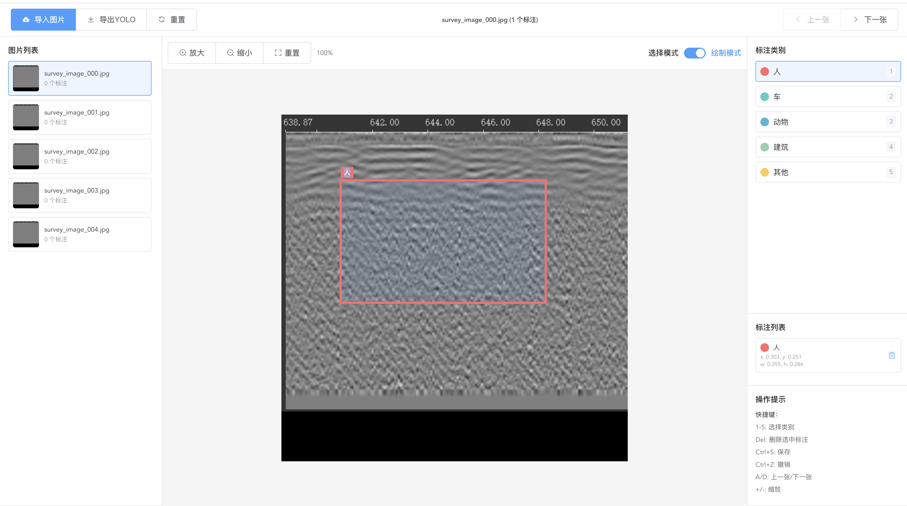

# YOLO Image Annotation Tool

A professional image annotation tool based on Vue2, specifically designed for YOLO format data annotation.

## 🖼️ Preview



## 🌟 Features

### Core Functions
- **Image Import**: Support drag-and-drop upload, multiple image formats (JPG, PNG, GIF, WebP)
- **Annotation Drawing**: Intuitive rectangular bounding box drawing
- **Annotation Editing**: Support moving, resizing, and deleting annotation boxes
- **Category Management**: Configurable annotation categories with color differentiation
- **YOLO Export**: One-click export to standard YOLO format annotation files

### Interactive Experience
- **Keyboard Shortcuts**: Rich keyboard shortcuts to improve annotation efficiency
- **Zoom View**: Support image zooming for precise annotation
- **Multi-image Annotation**: Batch processing of multiple images
- **Category Highlighting**: Different categories use different colors for distinction

### Technical Features
- **Vue2 Architecture**: Based on Vue2 + Vuex + Vue Router
- **Mock API**: Complete Mock data support for development and demonstration
- **Modular Design**: Clear project structure, easy to maintain and extend
- **Responsive Design**: Support for different screen sizes
- **Integration Ready**: Reserved interfaces for main system integration

## 📦 Installation & Running

### Requirements
- Node.js >= 14.0.0
- npm or yarn

### Install Dependencies
```bash
npm install
```

### Development Server
```bash
npm run serve
```

### Build for Production
```bash
npm run build
```

## 🚀 Quick Start

1. **Start the Project**
   ```bash
   npm run serve
   ```

2. **Access the Application**
   - Open browser and visit `http://localhost:8080`
   - The system will automatically redirect to the annotation page

3. **Start Annotating**
   - Click "Import Images" to upload images
   - Select annotation category
   - Draw annotation boxes on the image
   - Use keyboard shortcuts to improve efficiency

## 📋 User Guide

### Basic Operations

#### Image Import
- **Drag and Drop**: Drag image files to the upload area
- **Click to Select**: Click the upload area to select local images
- **Supported Formats**: JPG, PNG, GIF, WebP
- **File Size**: Maximum 10MB

#### Annotation Drawing
1. Select annotation category (left panel or use number keys 1-5)
2. Enable drawing mode
3. Hold left mouse button and drag on the image to draw annotation box
4. Release mouse to complete annotation

#### Annotation Editing
- **Select Annotation**: Click annotation box to select
- **Move Annotation**: Drag annotation box to new position
- **Resize**: Drag the resize handles on the edges of annotation box
- **Delete Annotation**: Select and click delete button or press Delete key

### Keyboard Shortcuts

| Shortcut | Function |
|----------|----------|
| 1-5 | Select annotation category |
| Delete | Delete selected annotation |
| Ctrl+S | Save current annotations |
| A | Previous image |
| D | Next image |
| + | Zoom in |
| - | Zoom out |

### Toolbar Functions

#### Main Toolbar
- **Import Images**: Upload new images
- **Export YOLO**: Export current image's annotations in YOLO format
- **Reset**: Clear all annotations of current image
- **Previous/Next**: Switch between images

#### Canvas Controls
- **Zoom In/Out**: Adjust image display size
- **Reset**: Restore original display ratio
- **Draw/Select Mode**: Switch annotation mode

## 🏗️ Project Structure

```
yolo-image-annotation/
├── public/                 # Static assets
│   └── index.html         # Main HTML file
├── src/
│   ├── api/               # API interfaces
│   │   └── index.js       # Mock API implementation
│   ├── components/        # Reusable components
│   │   ├── AnnotationCanvas.vue   # Annotation canvas component
│   │   └── ImageUpload.vue        # Image upload component
│   ├── router/            # Router configuration
│   │   └── index.js
│   ├── store/             # Vuex state management
│   │   └── index.js
│   ├── styles/            # Style files
│   │   └── global.css
│   ├── utils/             # Utility functions
│   │   └── yolo.js        # YOLO format conversion tools
│   ├── views/             # Page components
│   │   ├── Home.vue       # Home page
│   │   └── Annotation.vue # Annotation page
│   ├── App.vue            # Root component
│   └── main.js            # Application entry
├── package.json           # Project configuration
├── vue.config.js          # Vue configuration
└── README.md             # Project documentation
```

## 💾 Data Format

### Annotation Data Structure
```javascript
{
  id: 1,              // Annotation ID
  categoryId: 0,      // Category ID
  x: 0.2,            // Top-left X coordinate (relative 0-1)
  y: 0.3,            // Top-left Y coordinate (relative 0-1)
  width: 0.3,        // Width (relative 0-1)
  height: 0.4        // Height (relative 0-1)
}
```

### YOLO Format Output
```
class_id x_center y_center width height
```

Example:
```
0 0.350000 0.500000 0.300000 0.400000
1 0.600000 0.250000 0.200000 0.300000
```

## 🔧 Configuration

### Category Configuration
Modify category configuration in `src/store/index.js`:

```javascript
categories: [
  { id: 0, name: 'Person', color: '#ff6b6b' },
  { id: 1, name: 'Car', color: '#4ecdc4' },
  { id: 2, name: 'Animal', color: '#45b7d1' },
  { id: 3, name: 'Building', color: '#96ceb4' },
  { id: 4, name: 'Other', color: '#feca57' }
]
```

### API Configuration
Mock API is located in `src/api/index.js`, includes:
- `getImageList()`: Get image list
- `getAnnotations(imageId)`: Get annotation data
- `saveAnnotations(imageId, annotations)`: Save annotation data
- `uploadImage(file)`: Upload image
- `exportYOLO(imageIds)`: Export YOLO format

## 🔌 Integration Guide

### As Standalone Application
The project can run directly as a standalone application with `npm run serve`.

### Integration into Main System
1. **Component Integration**: Import `Annotation.vue` component into the main system
2. **API Replacement**: Replace Mock API with real backend interfaces
3. **Router Integration**: Integrate route configuration into main system router

### Interface Preparation
All API calls go through `src/api/index.js` module. When replacing:
1. Modify API base configuration
2. Update interface implementation
3. Keep data format consistent

## 🛠️ Development Guide

### Adding New Categories
1. Add category definition in Vuex store
2. Update color configuration
3. Update keyboard shortcut mapping (if needed)

### Extending Annotation Features
1. Modify `AnnotationCanvas.vue` component
2. Update data structure
3. Adjust YOLO export logic

### Custom Styling
- Global styles: `src/styles/global.css`
- Component styles: `<style>` sections in each component
- Theme configuration: `vue.config.js`

## 📝 API Documentation

### Image Management
- `GET /api/images` - Get image list
- `POST /api/images` - Upload image
- `DELETE /api/images/:id` - Delete image

### Annotation Management
- `GET /api/annotations/:imageId` - Get image annotations
- `POST /api/annotations/:imageId` - Save annotation data
- `POST /api/export/yolo` - Export YOLO format

## 🤝 Contributing

1. Fork the project
2. Create a feature branch (`git checkout -b feature/AmazingFeature`)
3. Commit your changes (`git commit -m 'Add some AmazingFeature'`)
4. Push to the branch (`git push origin feature/AmazingFeature`)
5. Create a Pull Request

## 📄 License

This project is licensed under the MIT License - see the [LICENSE](LICENSE) file for details

## 🙏 Acknowledgments

- [Vue.js](https://vuejs.org/) - Progressive JavaScript Framework
- [Element UI](https://element.eleme.io/) - Excellent Vue Component Library

---

## 📚 Language Versions

- [中文版本 (Chinese)](./README.md)
- [English Version](./README-EN.md) 