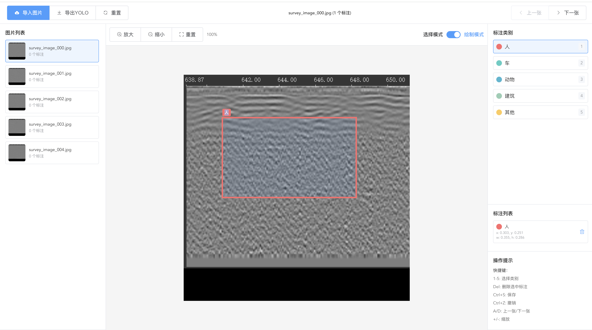

# YOLO 图像标注工具

一个基于 Vue2 的专业图像标注工具，专为 YOLO 格式数据标注而设计。

## 🖼️ 效果展示



## 🌟 功能特性

### 核心功能
- **图像导入**: 支持拖拽上传，多种图像格式（JPG、PNG、GIF、WebP）
- **标注绘制**: 直观的矩形标注框绘制
- **标注编辑**: 支持标注框的移动、缩放、删除
- **类别管理**: 可配置的标注类别，支持颜色区分
- **YOLO导出**: 一键导出标准 YOLO 格式标注文件

### 交互体验
- **快捷键支持**: 丰富的键盘快捷键提升标注效率
- **缩放查看**: 支持图像缩放以精确标注
- **多图标注**: 批量处理多张图像
- **类别高亮**: 不同类别使用不同颜色区分

### 技术特性
- **Vue2 架构**: 基于 Vue2 + Vuex + Vue Router
- **Mock API**: 完整的 Mock 数据支持，便于开发和演示
- **模块化设计**: 清晰的项目结构，易于维护和扩展
- **响应式设计**: 支持不同屏幕尺寸
- **集成预留**: 预留主系统集成接口

## 📦 安装与运行

### 环境要求
- Node.js >= 14.0.0
- npm 或 yarn

### 安装依赖
```bash
npm install
```

### 开发运行
```bash
npm run serve
```

### 构建生产版本
```bash
npm run build
```

## 🚀 快速开始

1. **启动项目**
   ```bash
   npm run serve
   ```

2. **访问应用**
   - 打开浏览器访问 `http://localhost:8080`
   - 系统会自动跳转到标注页面

3. **开始标注**
   - 点击"导入图片"上传图像
   - 选择标注类别
   - 在图像上绘制标注框
   - 使用快捷键提升效率

## 📋 使用指南

### 基本操作

#### 图像导入
- **拖拽上传**: 将图片文件拖拽到上传区域
- **点击选择**: 点击上传区域选择本地图片
- **支持格式**: JPG、PNG、GIF、WebP
- **文件大小**: 最大 10MB

#### 标注绘制
1. 选择标注类别（左侧面板或使用数字键 1-5）
2. 启用绘制模式
3. 在图像上按住鼠标左键拖拽绘制标注框
4. 释放鼠标完成标注

#### 标注编辑
- **选择标注**: 点击标注框选中
- **移动标注**: 拖拽标注框到新位置
- **调整大小**: 拖拽标注框边缘的调整手柄
- **删除标注**: 选中后点击删除按钮或按 Delete 键

### 快捷键

| 快捷键 | 功能 |
|--------|------|
| 1-5 | 选择标注类别 |
| Delete | 删除选中标注 |
| Ctrl+S | 保存当前标注 |
| A | 上一张图片 |
| D | 下一张图片 |
| + | 放大图像 |
| - | 缩小图像 |

### 工具栏功能

#### 主工具栏
- **导入图片**: 上传新图片
- **导出YOLO**: 导出当前图片的 YOLO 格式标注
- **重置**: 清空当前图片的所有标注
- **上一张/下一张**: 切换图片

#### 画布控制
- **放大/缩小**: 调整图像显示大小
- **重置**: 恢复原始显示比例
- **绘制/选择模式**: 切换标注模式

## 🏗️ 项目结构

```
yolo-image-annotation/
├── public/                 # 静态资源
│   └── index.html         # 主 HTML 文件
├── src/
│   ├── api/               # API 接口
│   │   └── index.js       # Mock API 实现
│   ├── components/        # 可复用组件
│   │   ├── AnnotationCanvas.vue   # 标注画布组件
│   │   └── ImageUpload.vue        # 图片上传组件
│   ├── router/            # 路由配置
│   │   └── index.js
│   ├── store/             # Vuex 状态管理
│   │   └── index.js
│   ├── styles/            # 样式文件
│   │   └── global.css
│   ├── utils/             # 工具函数
│   │   └── yolo.js        # YOLO 格式转换工具
│   ├── views/             # 页面组件
│   │   ├── Home.vue       # 首页
│   │   └── Annotation.vue # 标注页面
│   ├── App.vue            # 根组件
│   └── main.js            # 应用入口
├── package.json           # 项目配置
├── vue.config.js          # Vue 配置
└── README.md             # 项目文档
```

## 💾 数据格式

### 标注数据结构
```javascript
{
  id: 1,              // 标注ID
  categoryId: 0,      // 类别ID
  x: 0.2,            // 左上角X坐标（相对坐标 0-1）
  y: 0.3,            // 左上角Y坐标（相对坐标 0-1）
  width: 0.3,        // 宽度（相对坐标 0-1）
  height: 0.4        // 高度（相对坐标 0-1）
}
```

### YOLO 格式输出
```
class_id x_center y_center width height
```

示例：
```
0 0.350000 0.500000 0.300000 0.400000
1 0.600000 0.250000 0.200000 0.300000
```

## 🔧 配置说明

### 类别配置
在 `src/store/index.js` 中修改类别配置：

```javascript
categories: [
  { id: 0, name: '人', color: '#ff6b6b' },
  { id: 1, name: '车', color: '#4ecdc4' },
  { id: 2, name: '动物', color: '#45b7d1' },
  { id: 3, name: '建筑', color: '#96ceb4' },
  { id: 4, name: '其他', color: '#feca57' }
]
```

### API 配置
Mock API 位于 `src/api/index.js`，包含：
- `getImageList()`: 获取图片列表
- `getAnnotations(imageId)`: 获取标注数据
- `saveAnnotations(imageId, annotations)`: 保存标注数据
- `uploadImage(file)`: 上传图片
- `exportYOLO(imageIds)`: 导出 YOLO 格式

## 🔌 集成说明

### 作为独立应用
项目可以直接作为独立应用运行，通过 `npm run serve` 启动。

### 集成到主系统
1. **组件化集成**: 将 `Annotation.vue` 组件导入到主系统
2. **API 替换**: 将 Mock API 替换为真实后端接口
3. **路由集成**: 将路由配置集成到主系统路由中

### 接口预留
所有 API 调用都通过 `src/api/index.js` 模块，替换时只需：
1. 修改 API 基础配置
2. 更新接口实现
3. 保持数据格式一致

## 🛠️ 开发指南

### 添加新类别
1. 在 Vuex store 中添加类别定义
2. 更新颜色配置
3. 更新快捷键映射（如需要）

### 扩展标注功能
1. 修改 `AnnotationCanvas.vue` 组件
2. 更新数据结构
3. 调整 YOLO 导出逻辑

### 自定义样式
- 全局样式：`src/styles/global.css`
- 组件样式：各组件的 `<style>` 部分
- 主题配置：`vue.config.js`

## 📝 API 文档

### 图片管理
- `GET /api/images` - 获取图片列表
- `POST /api/images` - 上传图片
- `DELETE /api/images/:id` - 删除图片

### 标注管理
- `GET /api/annotations/:imageId` - 获取图片标注
- `POST /api/annotations/:imageId` - 保存标注数据
- `POST /api/export/yolo` - 导出 YOLO 格式

## 🤝 贡献指南

1. Fork 本项目
2. 创建功能分支 (`git checkout -b feature/AmazingFeature`)
3. 提交更改 (`git commit -m 'Add some AmazingFeature'`)
4. 推送到分支 (`git push origin feature/AmazingFeature`)
5. 创建 Pull Request

## 📄 许可证

本项目采用 MIT 许可证 - 详见 [LICENSE](LICENSE) 文件

## 🙏 致谢

- [Vue.js](https://vuejs.org/) - 渐进式 JavaScript 框架
- [Element UI](https://element.eleme.io/) - 优秀的 Vue 组件库

---

## 📚 语言版本

- [中文版本 (Chinese)](./README.md)
- [English Version](./README-EN.md)

---

**开始您的 YOLO 标注之旅！** 🚀 